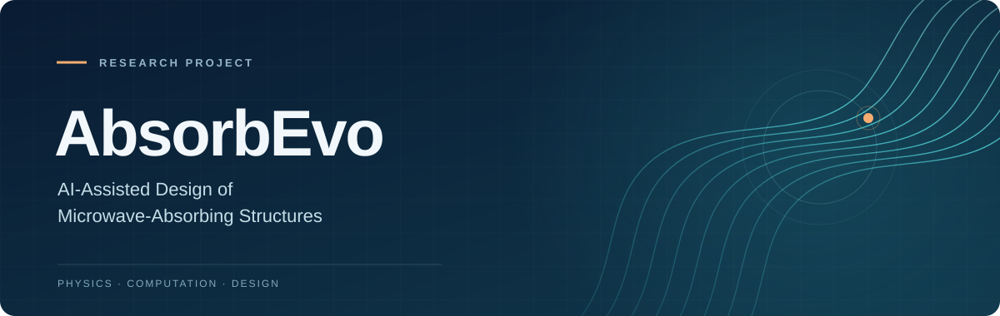

  

# AbsorbEvo

**AI-Assisted Design of Microwave-Absorbing Structures**

AbsorbEvo explores AI-assisted design and computational study of microwave-absorbing structures, bringing together artificial intelligence, physical knowledge, and electromagnetic simulation.

### Research themes

- Microwave-absorbing structure design
- Physics-informed computational research
- Electromagnetic simulation and scientific evaluation

### Project status

The main research work is complete, and a manuscript draft has been prepared.

### Public scope

This repository presents a public project overview. Source code, manuscript drafts, research data, and detailed results are not publicly available in this repository.

**Researcher:** [Zhicheng Feng](https://github.com/ZhichengFeng)

---

### 中文概览

**AbsorbEvo — 智能微波吸波结构设计研究**

本项目聚焦微波吸波结构的智能辅助设计与计算研究，探索人工智能、物理知识与电磁仿真在科研工作流中的协同应用。

- **研究主题：** 微波吸波结构设计、物理知识辅助的计算研究、电磁仿真与科学评价。
- **项目状态：** 主要研究工作已完成，论文初稿已形成。
- **公开范围：** 本仓库仅用于项目概览展示，不公开源代码、论文草稿、研究数据及详细结果。

**研究者：** [冯志成](https://github.com/ZhichengFeng)
