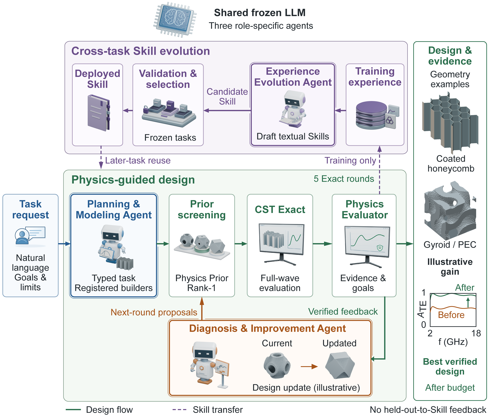
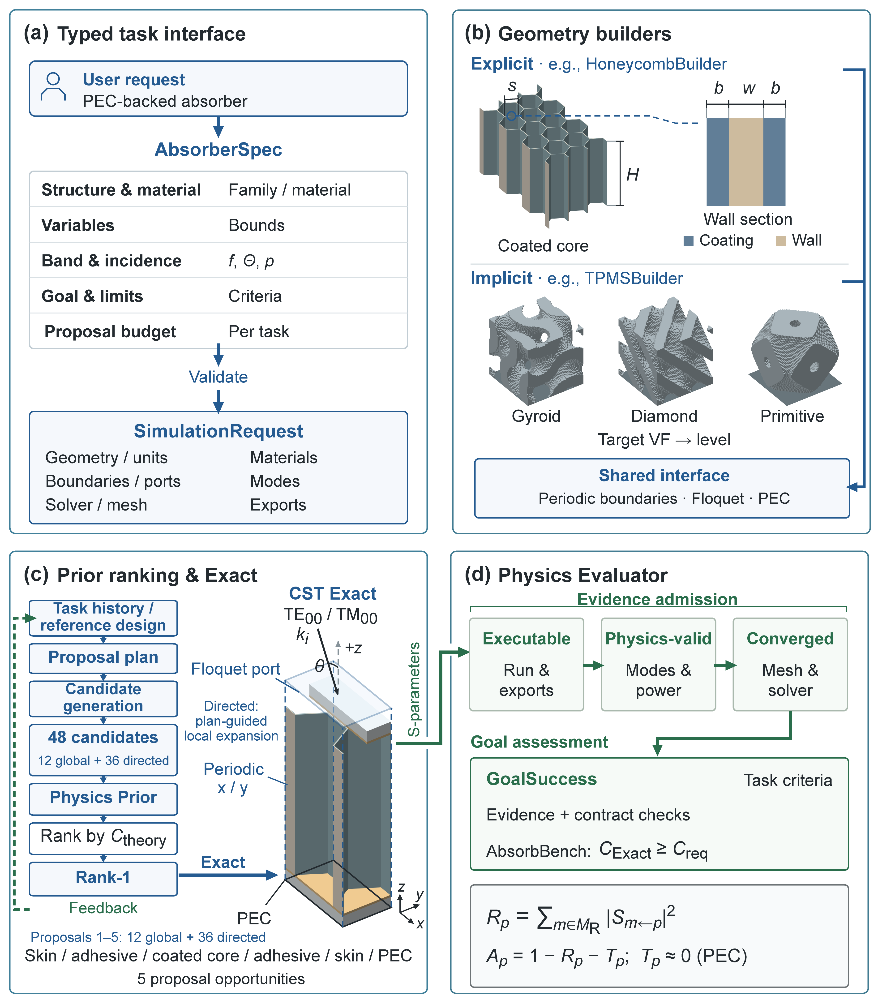
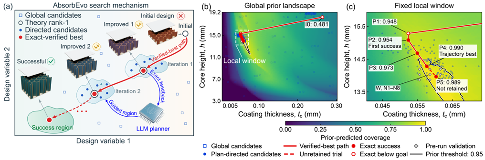
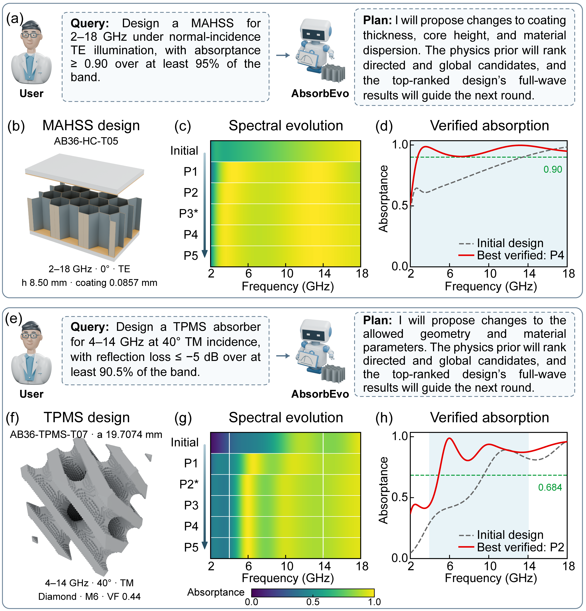

# AbsorbEvo

**Physics-guided agents for microwave-absorber inverse design**

AbsorbEvo connects language-model planning, physics-prior candidate ranking, full-wave simulation, and verified feedback to design **coated honeycomb sandwich structures** and **triply periodic minimal surface (TPMS) absorbers**. A separate cross-task Skill loop distills training experience into reusable textual guidance.

[**Explore AbsorbBench-36**](benchmarks/AbsorbBench-36/) · [Architecture](#architecture) · [Design workflow](#design-workflow) · [Search mechanism](#search-mechanism) · [Design examples](#design-examples)

## AbsorbBench-36

An open benchmark for evaluating **your own design agent**, with fixed task definitions, common initial designs, physical specifications, and evaluation tools.

| Design families | Tasks | Split | Proposal budget |
|---|---:|---|---|
| Honeycomb sandwich + TPMS | **36** (18 per family) | **8** development / **4** validation / **24** test | **5** new designs per task |

[**Get started →**](benchmarks/AbsorbBench-36/README.md) · [Task index](benchmarks/AbsorbBench-36/tasks.csv) · [Evaluation protocol](benchmarks/AbsorbBench-36/docs/protocol.md) · [Agent integration](benchmarks/AbsorbBench-36/docs/integration.md)

The benchmark package contains no AbsorbEvo method scores, optimized designs, or experimental trajectories. Supply your own agent and full-wave solver; the included Python tools validate inputs and score exported spectra.

## Architecture

<p align="center">
  <a href="assets/figure1.png">
    
  </a>
</p>

**Two connected learning loops.** Within each task, planning and candidate screening lead to full-wave verification and the next design proposal. Across training tasks, experience is distilled into textual Skills, validated, and reused on later tasks. The before/after curves in this architecture diagram are illustrative. [Open image](assets/figure1.png).

## Design workflow

<p align="center">
  <a href="assets/design-workflow.png">
    
  </a>
</p>

**From a design request to a verified proposal.** A typed task interface specifies the design space and goals. Geometry builders produce the physical model; the physics prior ranks candidate designs before full-wave evaluation. Evidence checks and task-specific criteria determine whether a proposal is valid and meets the goal. [Open image](assets/design-workflow.png).

## Search mechanism

<p align="center">
  <a href="assets/search-mechanism.png">
    
  </a>
</p>

**Global exploration with feedback-directed refinement.** The conceptual panel shows how candidate generation and verified feedback interact. The two-dimensional case plots locate the proposals on a prior-predicted coverage landscape and distinguish the retained verified-best path from an unretained trial. Prior predictions and full-wave outcomes are shown separately. [Open image](assets/search-mechanism.png).

## Design examples

<p align="center">
  <a href="assets/design-examples.png">
    
  </a>
</p>

**Two structure families, a shared design process.** The honeycomb example targets 2–18 GHz at normal-incidence TE illumination; the TPMS example targets 4–14 GHz at 40° TM incidence. Each row connects the request and plan to geometry, spectral evolution, and the best-verified absorption curve. These selected research examples illustrate the workflow; they are separate from the result-free benchmark package. [Open image](assets/design-examples.png).

## Project status and public scope

The main research study is complete and a manuscript draft has been prepared. This repository provides the project overview, the selected figures above, and the **AbsorbBench-36 task-and-evaluation package**. The full manuscript, private agent implementation, raw simulation records, and complete method-comparison results are not distributed here.

The benchmark directory is available under its [MIT License](benchmarks/AbsorbBench-36/LICENSE). That license does not extend to the manuscript figures in `assets/`.

**Researcher:** [Zhicheng Feng](https://github.com/ZhichengFeng)

## Citation

If you use AbsorbEvo or AbsorbBench-36 in your research, please cite [our paper](https://arxiv.org/abs/2610.01119):

```bibtex
@misc{feng2026absorbevo,
  title         = {{AbsorbEvo}: An Agentic Framework for Autonomous Inverse Design of Microwave Absorbers},
  author        = {Feng, Zhicheng and Zhao, Yubo and Yao, Xuefeng},
  year          = {2026},
  eprint        = {2610.01119},
  archivePrefix = {arXiv},
  primaryClass  = {cs.AI},
  url           = {https://arxiv.org/abs/2610.01119}
}
```
