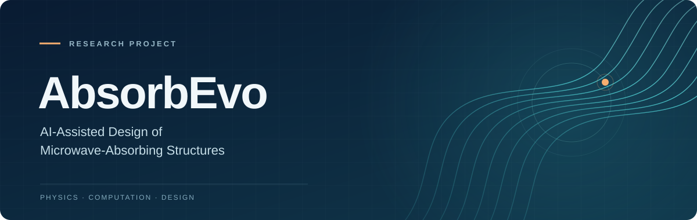

  

# AbsorbEvo

**AI-Assisted Design of Microwave-Absorbing Structures**

AbsorbEvo explores AI-assisted design and computational study of microwave-absorbing structures, bringing together artificial intelligence, physical knowledge, and electromagnetic simulation.

### Framework overview · 框架概览

  

**Figure 1 | Dual-loop architecture of AbsorbEvo.** Physics-guided design and cross-task Skill evolution. The before/after curves are illustrative. [View full-resolution figure](assets/figure1.png).

**图 1｜AbsorbEvo 双闭环架构。** 物理引导设计与跨任务 Skill 演化；图中前后对比曲线为示意。[查看高清图](assets/figure1.png)。

### Research themes

- Microwave-absorbing structure design
- Physics-informed computational research
- Electromagnetic simulation and scientific evaluation

### Project status

The main research work is complete, and a manuscript draft has been prepared.

### AbsorbBench-36 · Public benchmark

[**Use AbsorbBench-36 →**](benchmarks/AbsorbBench-36/README.md)

Evaluate your own design agent on **36 fixed microwave-absorber tasks**: 18 honeycomb sandwich tasks and 18 TPMS tasks, split into 8 development, 4 validation and 24 test tasks. The standard budget is five new design proposals per task.

The public package includes machine-readable tasks, common initial designs, parameter bounds, material/geometry specifications, and Python validation and scoring tools. Supply your own agent and full-wave solver. **No AbsorbEvo test results, optimized designs or performance trajectories are included.**

[Task index](benchmarks/AbsorbBench-36/tasks.csv) · [Evaluation protocol](benchmarks/AbsorbBench-36/docs/protocol.md) · [中文使用说明](benchmarks/AbsorbBench-36/README_zh.md)

### Public scope

This repository shares a public project overview, Figure 1 from the manuscript, and the result-free AbsorbBench-36 task-and-evaluation package. The full manuscript, private AbsorbEvo implementation, experimental results, and other manuscript figures are not included.

**Researcher:** [Zhicheng Feng](https://github.com/ZhichengFeng)

---

### 中文概览

**AbsorbEvo — 智能微波吸波结构设计研究**

本项目聚焦微波吸波结构的智能辅助设计与计算研究，探索人工智能、物理知识与电磁仿真在科研工作流中的协同应用。

- **研究主题：** 微波吸波结构设计、物理知识辅助的计算研究、电磁仿真与科学评价。
- **项目状态：** 主要研究工作已完成，论文初稿已形成。
- **公开基准：** [AbsorbBench-36](benchmarks/AbsorbBench-36/README_zh.md) 提供36项固定任务、初始设计参数、建模说明与评分工具，可用于测试其他智能体；每项任务五次新设计提案。
- **公开范围：** 项目概览、论文图1及不含测试结果的基准包。完整论文、AbsorbEvo私有实现、实验结果和其他论文图表不公开。

**研究者：** [冯志成](https://github.com/ZhichengFeng)
